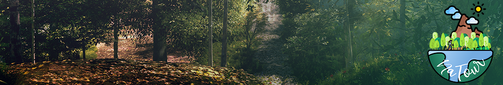

#+OPTIONS: date:nil title:nil toc:nil author:nil
#+STARTUP: overview
* Progetto Na-Tour
#+BEGIN_HTML

  <!-- License -->
  

  <!-- Android -->
  

#+END_HTML

* Info Generali
#+html: 

Questo progetto è l'implementazione della traccia di Ingegneria del Software (Anno 2021-2022).

* Contributori
#+BEGIN_HTML

#+END_HTML
